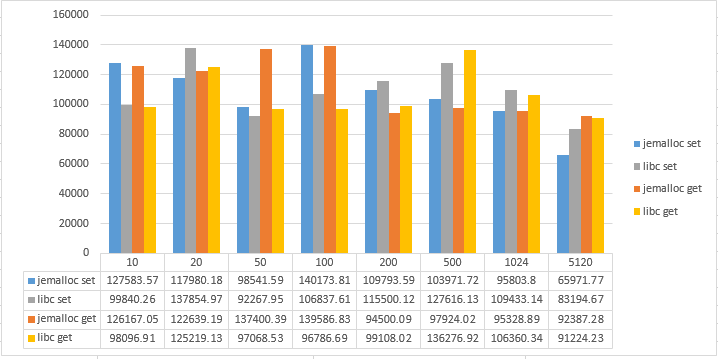
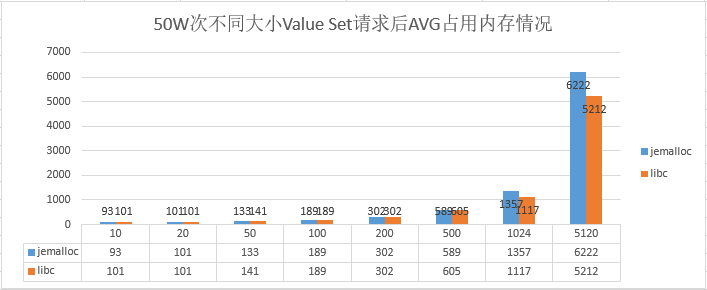
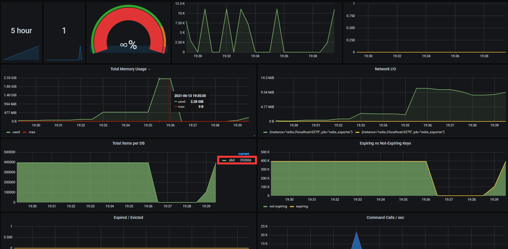
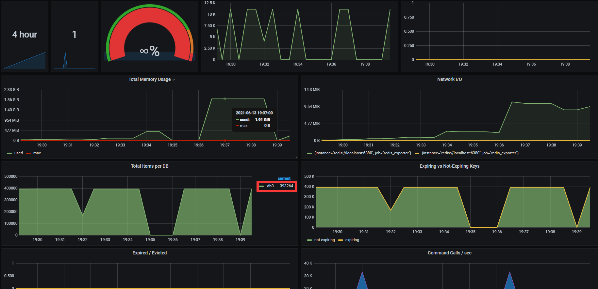

# go 进阶训练营 第八周 作业

## 问题

1. 使用 redis benchmark 工具| 测试 10 20 50 100 200 1k 5k 字节 value 大小，redis get set 性能。

2. 写入一定量的 kv 数据| 根据数据大小 1w-50w 自己评估| 结合写入前后的 info memory 信息  | 分析上述不同 value 大小下，平均每个 key 的占用内存空间。

## 环境准备

1. 安装配置Redis过程步骤 - [点击详见](./redis_install.md)

2. 监控使用Grafana + prometheus + redis_exporter - [搭建过程步骤点击详见](./monitor.md)

## benchmark方案

1. 采用centos 7.9 - 2核4GB虚似机进行测试

2. 分别针对jemalloc和libc内存分配进行测试

3. 采用redis自带的benchmark工具进行测试

4. 测试 10 20 50 100 200 1k 5k 字节 value 大小，各50w次，key随机生成50w次

5. [测试用指令详见](./benchmark-command.md)

## redis get set benchmark 性能

Requests|ValueSize|Set req/sec(jemalloc)|Get req/sec(jemalloc)|Set req/sec(libc)|Get req/sec(libc)
-|-|-|-|-|-
50w|10|127583.57|126167.05|99840.26|98096.91
50w|20|117980.18|122639.19|137854.97|125219.13
50w|50|98541.59|137400.39|92267.95|97068.53
50w|100|140173.81|139586.83|106837.61|96786.69
50w|200|109793.59|94500.09|115500.12|99108.02
50W|500|103971.72|97924.02|127616.13|136276.92
50w|1024|95803.8|95328.89|109433.14|106360.34
50w|5120|65971.77|92387.28|83194.67|91224.23

### 观察以上测试结果，得到以下几点

- jemalloc的效率与value size程反比趋势
- libc效率程现出一种波浪抖动态势
- value size在10~100 jemalloc方式set、get都比libc效率高
- value size在200~5120 libc方式set、get都比jemalloc效率高（5120时jemalloc的get效率与libc比较接近）

## 写入内存分析 - 测试结果

>> 50w次请求随机生成的Key，最终的key的数量在393000~394000之间浮动(随机生成的key会有重复，部分key会被重复更新)，之后的平均值采用393500这个中位数进行计算

Requests|ValueSize|memory(jemalloc)|avg(jemalloc)|memory(libc)|avg(libc)
-|-|-|-|-|-
50w|10|34.8M|93|37.9M|101
50w|20|37.9M|101|37.9M|101
50w|50|49.9M|133|52.9M|141
50w|100|70.9M|189|70.9M|189
50w|200|113M|302|113M|302
50W|500|221M|589|227M|605
50w|1024|509M|1357|419M|1117
50w|5120|2.28G|6222|1.91G|5212

### 观察以上测试结果，得到以下几点

1. value size在10 ~ 500 byte之间时jemalloc内存分配器比libc占用内存少；

2. value size在1024 byte及以上后时jemalloc内存分配器比libc占用内存多；

3. 以上两条并不能得出value size大小对jemalloc和libc分配内存存在标准阈值，还需要先从两者的分配算法原理以出发进行比较甄别；

4. 从上述平均内存占用可以看出,实际占用内存与value size的大小存在固定大小的差值

   - 从benchmark的帮助中可以看出key是一个12位数字，那么key需要占用掉8个byte

   - 通过学习redis的内部数据结构得知，在保存key或value时，在redis中需要使用RedsiObject这个结构来保存，对于字符串来说需要占用16 byte+字符串大小的内存

   - 保存key的hash表本身也要使用24个byte内存，再由于内存分配器的原因实际要占用32byte

   - (key = 8 + 8) + (value = 16 + valueSize) + (hash entry = 32) = 64 + valueSize + 内存分配器因为倍数分配内存多占用掉的

## 监控

### grafana - jemalloc

### grafana - libc

