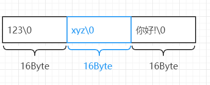
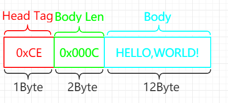

# go 进阶训练营 第九周 作业

## 问题

1. 总结几种 socket 粘包的解包方式: fix length/delimiter based/length field based frame decoder。尝试举例其应用;([解答](#总结socket粘包的解包方式))

2. 实现一个从 socket connection 中解码出 goim 协议的解码器。([方案说明](#goim协议的解码器说明))

## 总结socket粘包的解包方式

### fix length

>>>定长型包，每个包固定大小，主要适用于单一类型的包

- 优点：打包和解包算法简单

- 缺点：

    1. 包内容如果常常小于定长时，会有浪费;
    2. 包长度要改动时不灵活，服务端和客户端需要同时调整;

- encode：通常采用左对齐右补0方式填满包

- decode: 读取固定大小，一次没有读到足够大小内容，就继续读直到累加到内容长度等于固定大小为一包

- 图示

### delimiter based

>>>变长型包，每个包使用特殊符号做为结束符

- 优点：基本可以按照实际大小进行传输

- 缺点：

    1. 选用的特殊符号不能在Body中出现，否则会导致解包与封包不一至;
    2. 传递二进制内容时容易出现原因1的问题;

- encode：要发送内容后加上包分隔符

- decode: 一直读取到分隔符为一包

- 图示

    1. `_$`为包分隔符

### length field based frame decoder

>>>变长型包，固定位+变长位，固定位：一般包含包标示符，包长度，变长的要传递内容

- 优点：灵活，组包没有限制，适用于传递二进制包内容

- 缺点：

    1. 每个包都会有加上固定位，增多了要传递的内容;

- encode：包标示符(1 Byte) + 传递内容的长度(2 Byte) + 传递内容

- decode:

    1. 先读取固定长度3byte = 包标示符(1 Byte) + 传递内容的长度(2 Byte);
    2. 取byte[0]进行比较，是否为已知标识；
    3. 取byte[1:3]转化为数字，得到传递内容长度;
    4. 按传递内容长度读取内容，一次没有读到足够大小内容，就继续读直到累加读到的内容长度等于传递内容长度

- 图示

    1. `0xCE`为包标示符,长度固定为1Byte
    2. `0x000C`为包体长度,长度固定为2Byte

## goim协议的解码器说明
